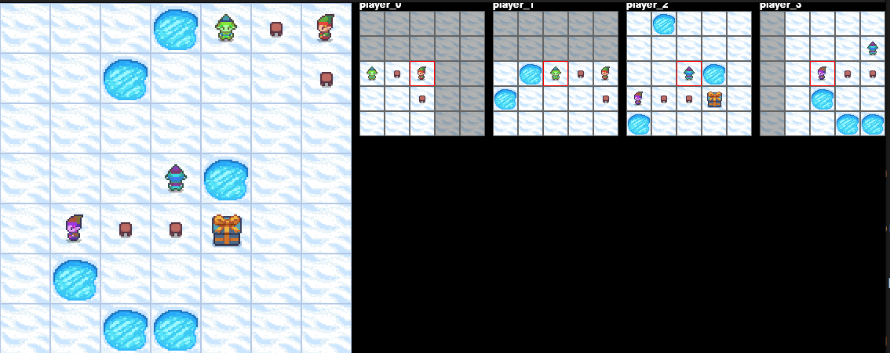

# Multi-Agent Frozen Lake
This repo implements a **multi-agent** version of [Frozen Lake](https://gymnasium.farama.org/environments/toy_text/frozen_lake/), adapted for collaborative multi-agent reinforcement learning.

## Environment Design

The environment preserves the mechanics of the original Frozen Lake but extends it to support multiple agents working together to reach their goals. This setup allows experimentation with coordination strategies, joint policies, and multi-agent learning algorithms.


*Multi-agent frozen lake, where the bigger map on the left is the full game state, and each smaller map on the right is an individual agent view*

Essentially, each agent:
1. Has a partial observation of the environment (ego-centric view of its surroundings)
1. Has a symbolic communication channel (and listens to other agents).
1. Earns personal rewards and team rewards.

Chairs represent a starting position for one agent (no environment mechanic). Gray snow tiles represent out-of-reach map zones. Agents do **not** collide with each other. Agents earn individual rewards for reaching and staying at the goal, and an additional team reward if all active agents reach the goal.

A detailed report of the project is available in [class-paper.pdf](./class-paper.pdf).

> ⚠️ Note: This paper was prepared as part of a **master's class project** and was **not published** at NeurIPS or any other conference.

## Running example
To run an env example, simply:
```bash
uv run python src/test_parallel.py
```

## 📜 Unlicense
Read more at [Unlicense](https://unlicense.org/)